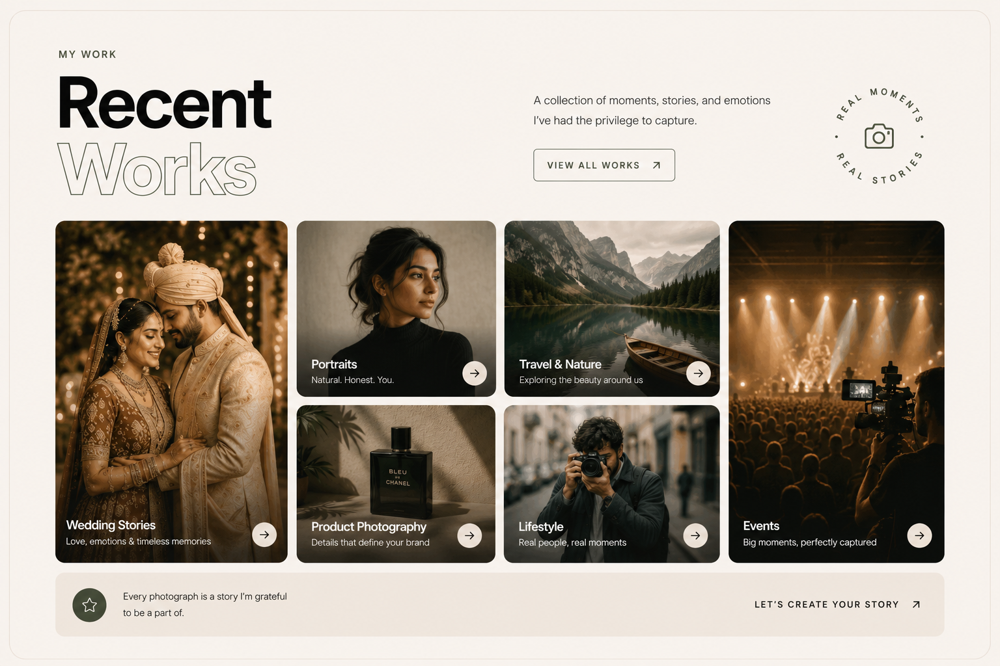
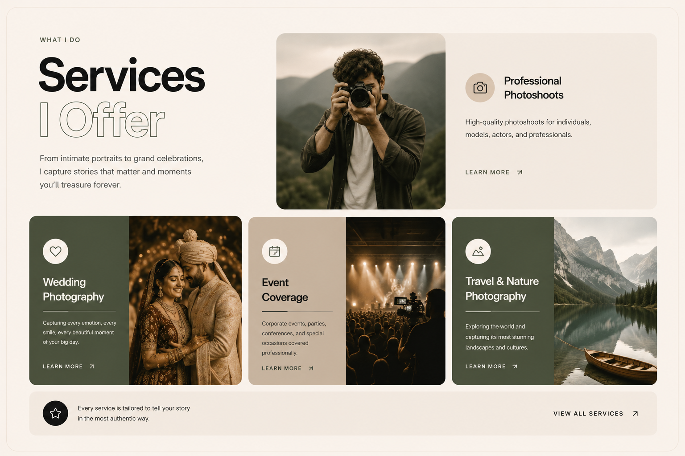

# Vikas Photography — Creative Portfolio Site

A premium, high-end creative portfolio website for a professional photographer. This site features editorial typography, smooth scrolling, and immersive, scroll-scrubbed interactive layouts.

---

## 📸 Project Showcase

### 1. Hero Section
Features minimalist branding, a camera shutter metadata badge, bold typography with outline effects, and smooth hover cursors.


### 2. Work Showcase (GSAP Parallax Grid)
Displays a staggered grid of architectural, wedding, and portrait photography. Images enter and exit the viewport with smooth, customized parallax speed transitions utilizing GSAP ScrollTrigger.


### 3. Services Stack (Editorial Pinning)
A vertical stack of editorial cards mapping brand, campaign, and content creation services. The cards rise, scale, and stack on top of each other as the user scrolls down, scrubbed 1:1 with scroll position.


### 4. Interactive Contact Form (Camera-Body Interface)
A custom-designed camera interface ("Get in Frame") incorporating:
- Viewfinder top plate and camera EOS branding.
- Bottom-border input fields with animated floating labels.
- A custom, responsive dropdown menu and full calendar date picker popover.
- A central, radial-gradient lens trigger (`Shoot`) with an aperture icon that rotates on hover.


---

## 🛠️ Technology Stack

- **Core**: React (v19) + Vite (v6)
- **Styling**: Tailwind CSS (v4) for max layout utility and smooth transitions.
- **Animations**:
  - **GSAP (GreenSock)** & **ScrollTrigger** for pin timelines and parallax grids.
  - **Lenis** for smooth scroll damping and easing.
  - **Framer Motion** for spring-based camera plate slide-ins.
- **Icons**: Lucide React & React Icons
- **Date Formatting**: date-fns

---

## 🚀 Getting Started

### Prerequisites
Make sure you have [Node.js](https://nodejs.org/) installed on your machine.

### Installation
1. Clone the repository:
   ```bash
   git clone https://github.com/vickeymadhukar/PhotoGraphyportfoliosite.git
   cd PhotoGraphyportfoliosite
   ```

2. Install dependencies:
   ```bash
   npm install
   ```

3. Run the local development server:
   ```bash
   npm run dev
   ```
   Open `http://localhost:5173` in your browser to view the portfolio.

### Building for Production
To build the project and output optimized production assets:
```bash
npm run build
```
The output will be generated inside the `dist/` folder.
